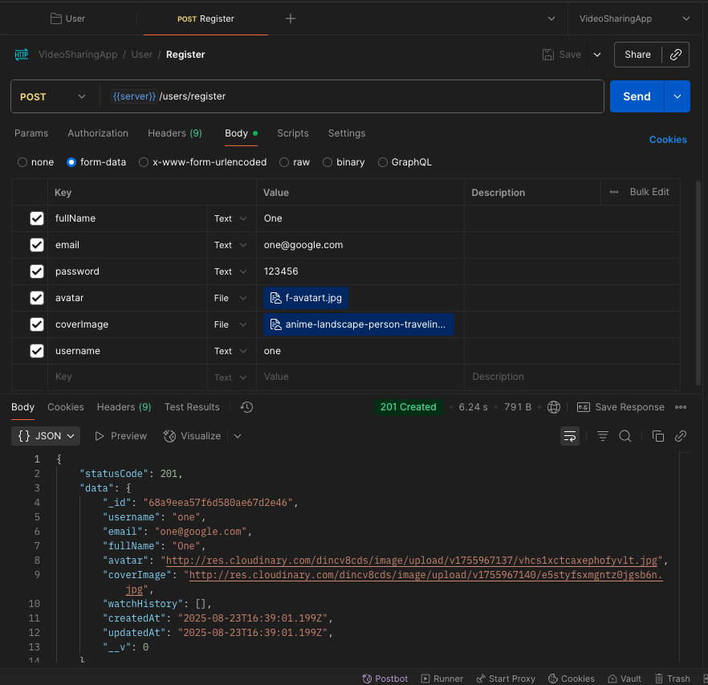

# Pensieve - A video sharing platform 

_A practice project to comprehand backend workflow better!_

## Best Practices & Steps

## 1. Database Communication Workflow
- **Always expect failures** — DB connections and queries can fail due to network, credentials, or query issues.
- **Wrap all DB calls in try/catch** to prevent app crashes and provide clear error messages.
- **Use `async/await`** for cleaner, synchronous-looking asynchronous code.
- **Create a dedicated DB connection function** in a `db/` directory.
- **Connect to DB before starting the server** — only start listening to requests after a successful connection.
- **In `index.js`**, call the DB connection function and use `.then().catch()` to start the server or handle connection errors.

---

## 2. Express Configuration with `use()`
- Use `app.use()` to register middlewares globally.
- Always configure these in the early stage of the app:
  1. **`express.json()`** → Parse JSON request bodies.
  2. **`express.urlencoded({ extended: true })`** → Parse URL-encoded form data (HTML forms).
  3. **`express.static()`** → Serve static assets from a public directory.
  4. **`cookie-parser`** → Parse cookies for authentication/session handling.
- Keep middleware setup **at the top** before route definitions.

---

## 3. Utility Function for `asyncHandler`
- Avoid repetitive `try/catch` in every async route handler.
- Create a utility function (`utils/asyncHandler.js`) to wrap async controllers.
- This wrapper automatically catches errors and forwards them to Express error middleware.
- Use `asyncHandler` for **every async route** to maintain a clean and consistent controller structure.

---

## 4. Standardizing API Errors and Responses
- Create a **custom API Error class** (`utils/ApiError.js`):
  - Stores `statusCode`, `message`, `errors[]`, and `stack trace`.
  - Ensures all errors follow the same structure.
- Create a **custom API Response class** (`utils/ApiResponse.js`):
  - Stores `statusCode`, `data`, `message`, and `success` flag.
  - Makes all successful responses consistent.
- **Benefits:**
  - Easier frontend integration (predictable response shape).
  - Simplified logging & debugging.


## 5. Model design

User and Video model design based on the Model Diagram

Now, to track the video watch history we have to study _Mongoose Aggregate Paginate_ queries.

We also will be using bcrypt and jwt. To use this encryption we will be using pre hook from mongoose. Methods will be used to generate refresh token and access token.

## 6. File upload
Cloudinary and Multer will be used. You have to study NodeJS fs (filesystem) for deep knowledge about files.

### Till now all we did was configuration

## 7. HTTP

Study about HTTP from Chai Aur Code video

## 8. Controller and route

- Create controllers with the help of "asyncHandler" that we created. This is a higher order wrapper function to handle try catch.
- Then create routes. 


# 9. User Registration Process Flow

This document explains the complete flow of user registration in a Node application with file upload functionality using Multer and Cloudinary.

## Overview

The registration process follows this flow:

1. **Route Setup** → 2. **Route Handler** → 3. **Controller Logic**

---

## 1. Main Application Setup (`app.js`)

### Routes Import and Declaration

```javascript
// Import the user routes
import userRouter from './routes/user.routes.js';

// Declare the routes with API versioning
app.use("/api/v1/users", userRouter);
```

**Purpose**: Sets up the base route `/api/v1/users` and connects it to the user router module.

---

## 2. Route Definition (`user.routes.js`)

### Route Configuration with Middleware

```javascript
import { Router } from "express";
import { registerUser } from "../controllers/user.controller.js";
import { upload } from "../middlewares/multer.middleware.js";

const router = Router(); 

router.route("/register").post(
    upload.fields([
        {
            name: "avatar",
            maxCount: 1
        },
        {
            name: "coverImage",
            maxCount: 1
        }
    ]),
    registerUser
);

export default router;
```

**Key Points:**

- Creates `/register` endpoint under `/api/v1/users`
- Final URL: `POST /api/v1/users/register`
- Uses Multer middleware for file uploads
- Expects two file fields: `avatar` (required) and `coverImage` (optional)
- Each field accepts maximum 1 file

---

## 3. Controller Logic (`user.controller.js`)

### Registration Process Implementation

```javascript
import { asyncHandler } from "../utils/asyncHandler.js";
import { ApiError } from "../utils/ApiError.js";
import { User } from "../models/user.model.js";
import { uploadOnCloudinary } from "../utils/cloudinary.js";
import { ApiResponse } from "../utils/ApiResponse.js";

const registerUser = asyncHandler(async(req, res) => {
    // Implementation follows step-by-step process
});
```

### Step-by-Step Registration Flow

#### Step 1: Extract User Data from Request

```javascript
const {fullName, email, username, password} = req.body;
console.log("\nuser.controller.js :: \n", req.body);
```

#### Step 2: Validate Required Fields

```javascript
if([fullName, email, username, password].some((field)=>field?.trim()==="")) {
    throw new ApiError(400, "All fields are required");
}
```

#### Step 3: Check for Existing User

```javascript
const existedUser = await User.findOne({
    $or: [{username}, {email}]
})
if(existedUser){
    throw new ApiError(409, "User with email or username already exits");
}
```

#### Step 4: Handle File Uploads

```javascript
const avatarLocalpath = req.files?.avatar[0]?.path;
const coverImageLocalPath = req.files?.coverImage[0]?.path;
console.log("\nuser.contorller.js :: \n", req.files);

if(!avatarLocalpath){
    throw new ApiError(400, "Avatar file is required");
}
```

#### Step 5: Upload Files to Cloudinary

```javascript
const avatar = await uploadOnCloudinary(avatarLocalpath);
const coverImage = await uploadOnCloudinary(coverImageLocalPath);

if(!avatar){
    throw new ApiError(400, "Avatar file is required");
}
```

#### Step 6: Create User in Database

```javascript
const user = await User.create({
    fullName,
    avatar: avatar.url,
    coverImage: coverImage?.url || "",
    email,
    password,
    username: username.toLowerCase(),
})
```

#### Step 7: Fetch Created User (without sensitive data)

```javascript
const createdUser = await User.findById(user._id).select(
    "-password -refreshToken"
);

if(!createdUser){
    throw new ApiError(500, "Something went wrong while registering the user");
}
```

#### Step 8: Return Success Response

```javascript
return res.status(201).json(
    new ApiResponse(201, createdUser, "User registered Successfully")
);
```

---

## Study the Request object

### req.body Structure

```json
{
  email: 'contact@aryan.com',
  password: 'abc123 ',
  username: 'ariyaan',
  fullName: 'Aryan Hossain'
}
```

### req.files Structure

```javascript
{
  avatar: [
    {
      fieldname: 'avatar',
      originalname: 'avatar-male.png',
      encoding: '7bit',
      mimetype: 'image/png',
      destination: './public/temp',
      filename: 'avatar-male.png',
      path: 'public/temp/avatar-male.png',
      size: 12346
    }
  ],
  coverImage: [
    {
      fieldname: 'coverImage',
      originalname: 'anime-landscape-person-traveling.jpg',
      encoding: '7bit',
      mimetype: 'image/jpeg',
      destination: './public/temp',
      filename: 'anime-landscape-person-traveling.jpg',
      path: 'public/temp/anime-landscape-person-traveling.jpg',
      size: 1627447
    }
  ]
}
```

---

## Complete Registration Flow Summary

1. **Client Request**: POST to `/api/v1/users/register` with form data
2. **Route Matching**: Express matches the route in `app.js`
3. **Route Handler**: `user.routes.js` processes the request
4. **Multer Middleware**: Handles file uploads and stores them locally
5. **Controller Execution**: `registerUser` function processes the registration
6. **Validation**: Checks required fields and existing users
7. **File Processing**: Uploads files to Cloudinary
8. **Database Operation**: Creates new user record
9. **Response**: Returns success response with user data

## Error Handling

The system uses custom `ApiError` class for consistent error responses:

- `400`: Bad Request (missing fields, missing avatar)
- `409`: Conflict (user already exists)
- `500`: Internal Server Error (database issues)


## Cloudinary response 

```json
{
  asset_id: 'ab3f64cc7b91c1b02158d6d875e97725',
  public_id: 'oloyppb7er52prtj8dqe',
  version: 1755964002,
  version_id: '2fd4e8d6c45df724ca4bb128f5f810c3',
  signature: 'e9205cbdf0a5556dff30a4c3c262ec05fa00c652',
  width: 626,
  height: 626,
  format: 'avif',
  resource_type: 'image',
  created_at: '2025-08-23T15:46:42Z',
  tags: [],
  pages: 1,
  bytes: 12346,
  type: 'upload',
  etag: 'c4d46ace42f123fefb9feee8cf0bfbed',
  placeholder: false,
  url: 'http://res.cloudinary.com/dincv8cds/image/upload/v1755964002/oloyppb7er52prtj8dqe.avif',
  secure_url: 'https://res.cloudinary.com/dincv8cds/image/upload/v1755964002/oloyppb7er52prtj8dqe.avif',
  asset_folder: '',
  display_name: 'oloyppb7er52prtj8dqe',
  original_filename: 'avatar-male',
  original_extension: 'png',
  api_key: '222367766695555'
}
```

## Postman testing




## Success Response Format

```json
{

"statusCode": 201,
"data": {
"_id": "68a9e2891744b72cc31ccb44",
"username": "ariyaan",
"email": "contact@aryan.com",
"fullName": "Aryan Hossain",
"avatar": "http://res.cloudinary.com/dincv8cds/image/upload/v1755964002/oloyppb7er52prtj8dqe.avif",
"coverImage": "http://res.cloudinary.com/dincv8cds/image/upload/v1755964041/wdpyhgvoecuhnzebdsfq.jpg",
"watchHistory": [],
"createdAt": "2025-08-23T15:47:21.886Z",
"updatedAt": "2025-08-23T15:47:21.886Z",
"__v": 0
},
"message": "User registered Successfully",
"success": true
}
```