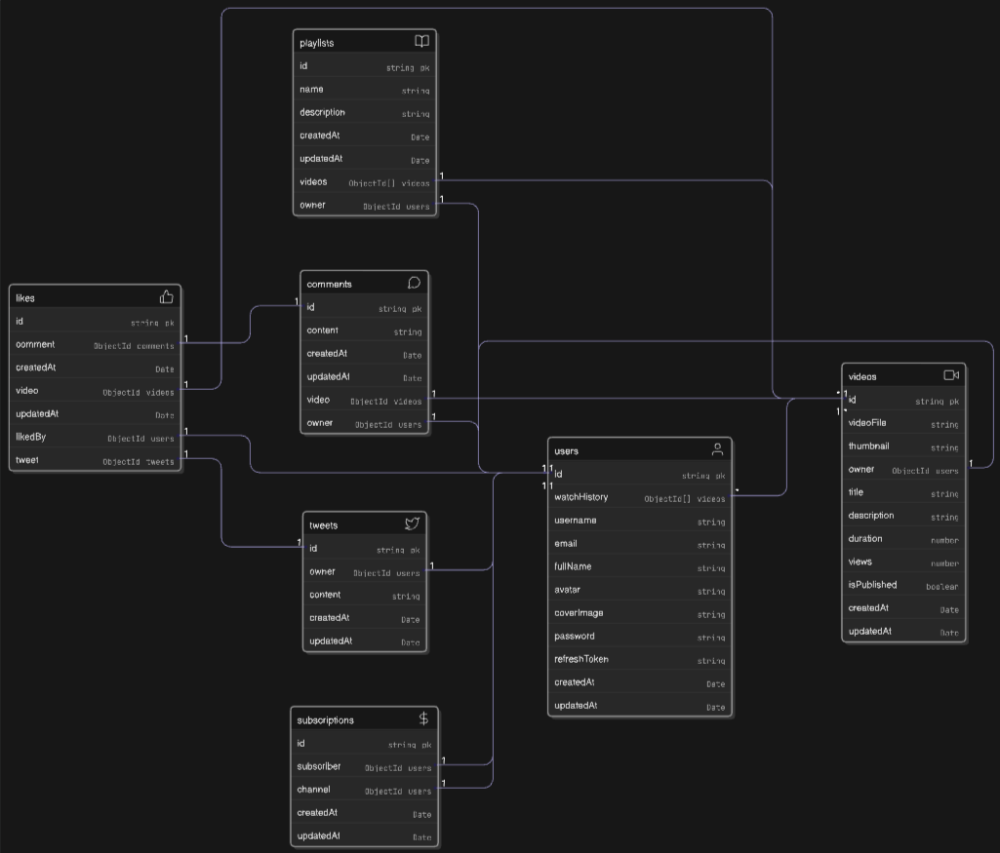

# Pensieve - Video Sharing Platform

Pensieve is a full-featured video sharing platform built with Node.js and MongoDB. It allows users to create profiles, upload and manage videos, interact with other users, and organize their favorite content.

## Features

- **User Profiles:**  
  Users can register, log in, and manage their profiles, including uploading avatars and cover images.

- **Video Uploads:**  
  Users can upload videos and thumbnails. Videos are stored securely and can be viewed by others.

- **Subscriptions:**  
  Users can subscribe to other channels and view subscriber counts for each channel.

- **Likes & Comments:**  
  Users can like videos and leave comments to interact with creators and other viewers.

- **Playlists:**  
  Users can create and manage playlists to organize their favorite videos.

- **Watch History:**  
  Each user's watch history is tracked and can be listed for easy access to previously watched content.

## Getting Started

1. **Clone the repository:**
   ```sh
   git clone https://github.com/yourusername/pensieve.git
   cd pensieve/backend
   ```

2. **Install dependencies:**
   ```sh
   npm install
   ```

3. **Configure environment variables:**  
   Copy `.env.sample` to `.env` and fill in your credentials.

4. **Run the development server:**
   ```sh
   npm run dev
   ```

## Data Model

## Data Modeling

Pensieve uses a relational data model with MongoDB to efficiently manage users, videos, playlists, subscriptions, likes, comments, and watch history. Each major feature is represented by a separate collection, with references between documents to maintain relationships.

- **User Model:**  
  Stores user profile information, authentication details, avatar, cover image, and references to uploaded videos, playlists, subscriptions, and watch history.

- **Video Model:**  
  Contains video metadata (title, description, upload date, etc.), file URLs, owner reference, likes, comments, and playlist associations.

- **Playlist Model:**  
  Represents user-created playlists, including title, description, owner, and an array of video references.

- **Subscription Model:**  
  Tracks which users are subscribed to which channels, enabling subscriber counts and notifications.

- **Like & Comment Models:**  
  Store user interactions with videos, including likes and comments, each referencing the user and the video.

- **Watch History Model:**  
  Maintains a list of videos watched by each user, with timestamps for tracking viewing activity.



## API Endpoints

### User Endpoints

- `/api/v1/users/register` - Register a new user
- `/api/v1/users/login` - Log in
- `/api/v1/users/logout` - Log out
- `/api/v1/users/refresh-token` - Refresh access token
- `/api/v1/users/change-password` - Change password
- `/api/v1/users/current-user` - Get current user profile
- `/api/v1/users/update-account` - Update profile details
- `/api/v1/users/avatar` - Update avatar
- `/api/v1/users/cover-image` - Update cover image
- `/api/v1/users/c/:username` - Get channel profile (with subscribers count)
- `/api/v1/users/history` - Get watch history

### Video Endpoints

- `/api/v1/videos/upload` - Upload a new video
- `/api/v1/videos/:id` - Get video details by ID
- `/api/v1/videos/:id/update` - Update video details (title, description, etc.)
- `/api/v1/videos/:id/delete` - Delete a video
- `/api/v1/videos/:id/like` - Like or unlike a video
- `/api/v1/videos/:id/comment` - Add a comment to a video
- `/api/v1/videos/:id/comments` - Get all comments for a video
- `/api/v1/videos/:id/playlist` - Add video to a playlist

### Playlist Endpoints

- `/api/v1/playlists/create` - Create a new playlist
- `/api/v1/playlists/:id` - Get playlist details
- `/api/v1/playlists/:id/update` - Update playlist details
- `/api/v1/playlists/:id/delete` - Delete a playlist

### Subscription Endpoints

- `/api/v1/users/:id/subscriptions` - Get all channels a user is subscribed to
- `/api/v1/channels/:id/subscribers` - Get all subscribers for a channel

## Technologies Used

- Node.js
- Express.js
- MongoDB & Mongoose
- Cloudinary (for media storage)
- JWT Authentication
- Multer (for file uploads)

## License

This project is licensed under the